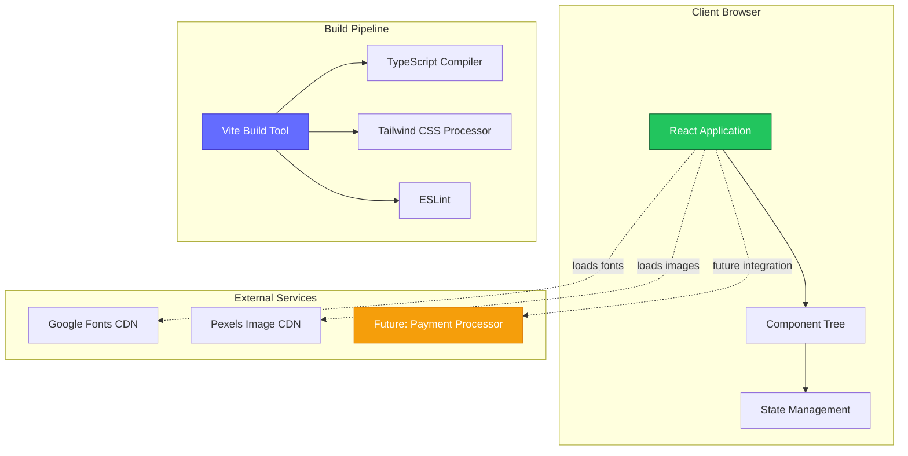
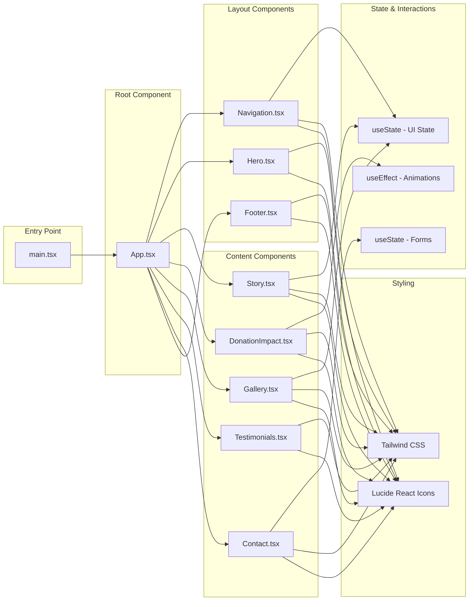

# Help Jerry - SMA Support Donation Platform

## Overview

Help Jerry is a modern, responsive web application designed to raise awareness and gather financial support for Jerry Farris, a 53-year-old individual living with Spinal Muscular Atrophy (SMA). The platform serves as a bridge between Jerry's family and potential donors, providing an engaging way to share Jerry's story, display the impact of donations, and facilitate community support.

The project aims to:
- **Raise Awareness**: Educate visitors about Spinal Muscular Atrophy and its impact on Jerry's daily life
- **Facilitate Donations**: Provide a user-friendly interface to encourage and track donation contributions
- **Build Community**: Connect supporters with Jerry's journey through testimonials, galleries, and contact forms
- **Demonstrate Impact**: Show tangible results of community support through real-time statistics and progress tracking

### Key Use Cases
- Individuals seeking to support Jerry's medical care and quality of life needs
- Family members and caregivers sharing Jerry's story with their networks
- Community organizers coordinating fundraising campaigns
- Medical professionals and SMA advocacy groups looking for patient stories
- Donors wanting to track their impact and stay connected with updates

## Features

- **Responsive Hero Section**: Eye-catching landing page with clear call-to-action buttons for donations
- **Interactive Story Presentation**: Expandable/collapsible narrative about Jerry's life with SMA
- **Animated Impact Statistics**: Real-time counter animations showing:
  - Number of generous donors (230+)
  - Children who donated (48)
  - Total funds raised ($3,400)
  - Fundraising goal ($15,000)
- **Photo Gallery**: Interactive lightbox gallery showcasing Jerry's daily life and care journey
- **Testimonials Section**: Authentic quotes from Jerry's caregiver, family, and supporters
- **Contact Form**: User-friendly form for messages of support and inquiries
- **Smooth Navigation**: Sticky navigation bar with smooth scrolling to sections
- **Mobile-First Design**: Fully responsive layout optimized for all device sizes
- **Accessibility Features**: Semantic HTML and ARIA-compliant components
- **Modern UI/UX**: Tailwind CSS-powered design with smooth animations and transitions

## Architecture

### High-Level System Overview

Help Jerry is a client-side single-page application (SPA) built with modern frontend technologies. The application follows a component-based architecture using React and TypeScript, with no backend dependency for the current implementation.



### Low-Level Module Interactions

The application is organized into distinct layers with clear separation of concerns:



#### Component Interaction Flow

1. **Application Bootstrap** (`main.tsx`)
   - Initializes React root element
   - Wraps app in StrictMode for development checks
   - Loads global CSS styles

2. **Root Component** (`App.tsx`)
   - Orchestrates all child components
   - Manages donation click handler that controls scroll behavior
   - Passes callbacks to child components for interaction

3. **Navigation Component** (`Navigation.tsx`)
   - Monitors scroll position via `useEffect` hook
   - Updates sticky navigation appearance based on scroll state
   - Manages mobile menu toggle state
   - Handles smooth scrolling to page sections

4. **Hero Component** (`Hero.tsx`)
   - Receives donation callback from parent
   - Provides primary and secondary CTAs
   - Implements scroll-to-story functionality

5. **Story Component** (`Story.tsx`)
   - Manages expandable content state
   - Provides read more/less toggle functionality

6. **DonationImpact Component** (`DonationImpact.tsx`)
   - Implements counter animations using `useEffect` and `setInterval`
   - Displays real-time statistics
   - Provides donation CTA with parent callback

7. **Gallery Component** (`Gallery.tsx`)
   - Manages lightbox state for photo viewing
   - Implements keyboard navigation for photo carousel
   - Loads images from external CDN (Pexels)

8. **Contact Component** (`Contact.tsx`)
   - Manages form state via controlled components
   - Handles form submission (currently client-side only)
   - Provides success feedback to users

### Design Patterns

- **Component Composition**: Breaking down UI into reusable, isolated components
- **Props Drilling**: Passing callbacks from parent to child for event handling
- **Controlled Components**: Form inputs managed by React state
- **Container/Presentational**: Separation of logic (state) and presentation
- **Hooks Pattern**: Using built-in React hooks (useState, useEffect) for state and side effects
- **Render Props**: Conditional rendering based on component state
- **CSS-in-JS**: Utility-first approach with Tailwind CSS classes

### Architectural Decisions

1. **Single Page Application (SPA)**: Chosen for smooth user experience without page reloads
2. **No Backend (Currently)**: Static site deployment for simplicity and cost-effectiveness
3. **Component-Based Architecture**: Maximizes reusability and maintainability
4. **TypeScript**: Type safety prevents runtime errors and improves developer experience
5. **Vite Build Tool**: Fast development server and optimized production builds
6. **Tailwind CSS**: Rapid UI development with consistent design system
7. **Lucide Icons**: Lightweight, consistent icon library

## Folder Structure

```
helpjerry-2/
├── .git/                      # Git version control directory
├── dist/                      # Production build output (generated)
├── node_modules/              # NPM dependencies (generated)
├── src/                       # Source code directory
│   ├── components/            # React components
│   │   ├── Navigation.tsx     # Sticky navigation bar with mobile menu
│   │   ├── Hero.tsx          # Landing hero section with CTAs
│   │   ├── Story.tsx         # Jerry's story with expandable content
│   │   ├── DonationImpact.tsx # Impact statistics with animations
│   │   ├── Gallery.tsx       # Photo gallery with lightbox
│   │   ├── Testimonials.tsx  # Quotes from family and supporters
│   │   ├── Contact.tsx       # Contact form component
│   │   └── Footer.tsx        # Footer with links and social media
│   ├── App.tsx               # Root application component
│   ├── main.tsx              # Application entry point
│   ├── index.css             # Global styles and Tailwind imports
│   └── vite-env.d.ts         # Vite TypeScript type definitions
├── .gitignore                # Git ignore patterns
├── eslint.config.js          # ESLint configuration for code quality
├── index.html                # HTML entry point
├── package.json              # NPM package configuration
├── package-lock.json         # NPM dependency lock file
├── postcss.config.js         # PostCSS configuration for Tailwind
├── tailwind.config.js        # Tailwind CSS configuration
├── tsconfig.json             # TypeScript base configuration
├── tsconfig.app.json         # TypeScript app-specific config
├── tsconfig.node.json        # TypeScript Node.js config
├── vite.config.ts            # Vite build tool configuration
└── README.md                 # Project documentation (this file)
```

### Key Directory and File Explanations

- **`src/components/`**: Contains all React functional components. Each component is self-contained with its own logic, state, and styling via Tailwind classes.

- **`src/App.tsx`**: The main application component that composes all page sections and manages global interaction handlers like the donation button click.

- **`src/main.tsx`**: The JavaScript entry point that mounts the React application to the DOM's root element.

- **`src/index.css`**: Contains Tailwind directives and any global CSS styles applied across the application.

- **`index.html`**: The HTML template that serves as the shell for the React application. Includes meta tags for SEO and social sharing.

- **Configuration Files**:
  - `vite.config.ts`: Configures Vite development server and build optimization
  - `tailwind.config.js`: Defines Tailwind CSS customizations and content paths
  - `tsconfig.*.json`: TypeScript compiler options for different contexts
  - `eslint.config.js`: Code quality rules and linting configuration
  - `postcss.config.js`: CSS processing pipeline (required by Tailwind)

## Setup & Installation

### Prerequisites

Before you begin, ensure you have the following installed on your system:

| Tool | Minimum Version | Purpose |
|------|----------------|---------|
| **Node.js** | 18.x or higher | JavaScript runtime environment |
| **npm** | 9.x or higher | Package manager (comes with Node.js) |
| **Git** | 2.x or higher | Version control (optional, for cloning) |

**Recommended**: Use [nvm](https://github.com/nvm-sh/nvm) (Node Version Manager) to manage Node.js versions.

To verify your installations:

```bash
node --version  # Should output v18.x.x or higher
npm --version   # Should output 9.x.x or higher
```

### Installation Steps

1. **Clone the repository**

```bash
git clone https://github.com/OluwaFavour/helpjerry-2.git
cd helpjerry-2
```

2. **Install dependencies**

```bash
npm install
```

This command will:
- Download all required packages listed in `package.json`
- Create a `node_modules` directory with dependencies
- Generate a `package-lock.json` file (if not present)

3. **Verify installation**

```bash
npm run lint  # Run code linting
npm run build # Build the production bundle
```

If both commands complete without errors, your setup is successful.

## Configuration

### Environment Variables

Currently, this application does not require environment variables for basic functionality. However, for future integrations, you may need to configure:

| Variable | Required | Default | Description |
|----------|----------|---------|-------------|
| `VITE_API_URL` | No | N/A | Backend API URL for form submissions (future) |
| `VITE_PAYMENT_GATEWAY` | No | N/A | Payment processor endpoint (e.g., PayPal, Stripe) |
| `VITE_GA_TRACKING_ID` | No | N/A | Google Analytics tracking ID for visitor analytics |

To use environment variables with Vite:

1. Create a `.env` file in the project root:

```bash
# .env
VITE_API_URL=https://api.example.com
VITE_PAYMENT_GATEWAY=https://paypal.com/donate/campaign-id
```

2. Access variables in your code using `import.meta.env`:

```typescript
const apiUrl = import.meta.env.VITE_API_URL;
```

**Note**: All Vite environment variables must be prefixed with `VITE_` to be exposed to the client-side code.

### Configuration Files

#### `vite.config.ts`
Configures the Vite build tool:
- **Plugins**: React plugin for JSX transformation
- **Optimization**: Excludes `lucide-react` from dependency pre-bundling

```typescript
import { defineConfig } from 'vite';
import react from '@vitejs/plugin-react';

export default defineConfig({
  plugins: [react()],
  optimizeDeps: {
    exclude: ['lucide-react'],
  },
});
```

#### `tailwind.config.js`
Defines Tailwind CSS settings:
- **Content**: Specifies files to scan for Tailwind classes
- **Theme**: Extends default Tailwind theme (currently using defaults)
- **Plugins**: Additional Tailwind plugins (none currently)

#### `tsconfig.json`
TypeScript compiler configuration:
- Extends app and node configurations
- Enables strict type checking
- Sets module resolution to bundler mode

## Running the Project

### Development Mode

Start the development server with hot module replacement (HMR):

```bash
npm run dev
```

This will:
- Start Vite development server
- Open the application at `http://localhost:5173` (default)
- Enable hot reloading (changes reflect instantly)
- Provide source maps for debugging

**Development Features**:
- Fast refresh on file changes
- Detailed error messages in browser
- React DevTools compatibility
- TypeScript type checking on save

### Building for Production

Create an optimized production build:

```bash
npm run build
```

This command:
- Compiles TypeScript to JavaScript
- Bundles all assets (JS, CSS, images)
- Minifies and optimizes code
- Outputs to `dist/` directory
- Generates gzipped size estimates

**Build Output Example**:
```
dist/index.html                   1.39 kB │ gzip:  0.59 kB
dist/assets/index-DwVMWEAw.css   18.87 kB │ gzip:  4.17 kB
dist/assets/index-B1lAJVvx.js   173.56 kB │ gzip: 53.25 kB
```

### Preview Production Build

Test the production build locally:

```bash
npm run preview
```

This starts a local static server serving the `dist/` directory, typically at `http://localhost:4173`.

### Linting

Check code quality and style:

```bash
npm run lint
```

This runs ESLint to identify:
- TypeScript type errors
- Code style violations
- React-specific issues (hooks, refresh)
- Potential bugs

## Testing

### Current Testing Strategy

**Note**: This project currently does not have automated tests implemented. The following sections outline recommended testing strategies for future implementation.

### Recommended Test Setup

For a comprehensive testing strategy, consider implementing:

1. **Unit Tests**: Test individual components in isolation
   - **Tool**: [Vitest](https://vitest.dev/) (Vite-native test runner)
   - **Library**: [React Testing Library](https://testing-library.com/react)
   
2. **Integration Tests**: Test component interactions
   - **Tool**: Vitest + React Testing Library
   - **Focus**: Form submissions, navigation flows, state updates

3. **End-to-End Tests**: Test complete user workflows
   - **Tool**: [Playwright](https://playwright.dev/) or [Cypress](https://www.cypress.io/)
   - **Scenarios**: Donation flow, contact form, gallery interactions

### Future Test Implementation

To add testing to this project:

1. **Install test dependencies**:

```bash
npm install -D vitest @testing-library/react @testing-library/jest-dom @testing-library/user-event jsdom
```

2. **Create test configuration** (`vitest.config.ts`):

```typescript
import { defineConfig } from 'vitest/config';
import react from '@vitejs/plugin-react';

export default defineConfig({
  plugins: [react()],
  test: {
    environment: 'jsdom',
    globals: true,
    setupFiles: './src/test/setup.ts',
  },
});
```

3. **Add test scripts to `package.json`**:

```json
"scripts": {
  "test": "vitest",
  "test:ui": "vitest --ui",
  "test:coverage": "vitest --coverage"
}
```

4. **Write component tests**:

```typescript
// src/components/__tests__/Hero.test.tsx
import { render, screen } from '@testing-library/react';
import { describe, it, expect, vi } from 'vitest';
import Hero from '../Hero';

describe('Hero Component', () => {
  it('renders the main heading', () => {
    const mockDonate = vi.fn();
    render(<Hero onDonateClick={mockDonate} />);
    expect(screen.getByText(/Help Jerry Farris Fight/i)).toBeInTheDocument();
  });
});
```

## Deployment

### Deployment Options

This static site can be deployed to various hosting platforms. Below are recommended options:

#### 1. **Vercel** (Recommended)

Vercel offers seamless integration with Git repositories and automatic deployments.

**Steps**:
1. Push your code to GitHub
2. Visit [vercel.com](https://vercel.com) and sign in
3. Click "New Project" and import your repository
4. Vercel auto-detects Vite configuration
5. Click "Deploy"

**Configuration**:
- Build Command: `npm run build`
- Output Directory: `dist`
- Install Command: `npm install`

**Benefits**:
- Automatic deployments on git push
- Free SSL certificates
- Global CDN distribution
- Preview deployments for pull requests

#### 2. **Netlify**

Similar to Vercel with drag-and-drop deployment options.

**Steps**:
1. Build the project: `npm run build`
2. Visit [netlify.com](https://netlify.com) and sign in
3. Drag and drop the `dist/` folder
4. Or connect your Git repository for automatic deployments

**Configuration**:
- Build Command: `npm run build`
- Publish Directory: `dist`

#### 3. **GitHub Pages**

Free hosting directly from your GitHub repository.

**Steps**:

1. Install `gh-pages` package:

```bash
npm install -D gh-pages
```

2. Add deployment scripts to `package.json`:

```json
"scripts": {
  "predeploy": "npm run build",
  "deploy": "gh-pages -d dist"
}
```

3. Update `vite.config.ts` with base path:

```typescript
export default defineConfig({
  base: '/helpjerry-2/',
  plugins: [react()],
});
```

4. Deploy:

```bash
npm run deploy
```

#### 4. **Docker Deployment**

For containerized deployments, create a `Dockerfile`:

```dockerfile
# Build stage
FROM node:18-alpine AS build
WORKDIR /app
COPY package*.json ./
RUN npm ci
COPY . .
RUN npm run build

# Production stage
FROM nginx:alpine
COPY --from=build /app/dist /usr/share/nginx/html
EXPOSE 80
CMD ["nginx", "-g", "daemon off;"]
```

**Build and run**:

```bash
docker build -t helpjerry .
docker run -p 8080:80 helpjerry
```

Access at `http://localhost:8080`

#### 5. **AWS S3 + CloudFront**

For enterprise-grade hosting:

1. **Build the project**: `npm run build`
2. **Create S3 bucket**: Enable static website hosting
3. **Upload dist/ contents**: Use AWS CLI or Console
4. **Configure CloudFront**: Add CDN distribution pointing to S3
5. **Set up SSL**: Use AWS Certificate Manager

### CI/CD Pipeline

Example GitHub Actions workflow (`.github/workflows/deploy.yml`):

```yaml
name: Deploy to Production

on:
  push:
    branches: [main]

jobs:
  deploy:
    runs-on: ubuntu-latest
    steps:
      - uses: actions/checkout@v3
      
      - name: Setup Node.js
        uses: actions/setup-node@v3
        with:
          node-version: '18'
          
      - name: Install dependencies
        run: npm ci
        
      - name: Run linter
        run: npm run lint
        
      - name: Build
        run: npm run build
        
      - name: Deploy to Vercel
        uses: amondnet/vercel-action@v20
        with:
          vercel-token: ${{ secrets.VERCEL_TOKEN }}
          vercel-org-id: ${{ secrets.ORG_ID }}
          vercel-project-id: ${{ secrets.PROJECT_ID }}
```

## Services & Integrations

### Current External Services

#### 1. **Google Fonts CDN**
- **Purpose**: Load Inter font family for typography
- **Connection**: Linked in `index.html` via CDN
- **Configuration**: Font weights 300, 400, 500, 600, 700
- **URL**: `https://fonts.googleapis.com`

#### 2. **Pexels Image CDN**
- **Purpose**: Host gallery photos
- **Connection**: Images loaded via `` tags in Gallery component
- **Configuration**: Images optimized with `auto=compress&cs=tinysrgb&w=800`
- **Note**: In production, consider hosting images locally or using a dedicated media management service

### Future Integration Recommendations

#### 1. **Payment Gateways**

For donation processing, integrate one of these services:

**PayPal**:
```typescript
// In Hero.tsx or DonationImpact.tsx
const handleDonateClick = () => {
  window.open('https://www.paypal.com/donate?campaign_id=YOUR_ID', '_blank');
};
```

**Stripe Checkout**:
```typescript
import { loadStripe } from '@stripe/stripe-js';

const stripe = await loadStripe('pk_test_YOUR_KEY');
const { error } = await stripe.redirectToCheckout({
  lineItems: [{ price: 'price_ID', quantity: 1 }],
  mode: 'payment',
  successUrl: 'https://helpjerry.com/success',
  cancelUrl: 'https://helpjerry.com/cancel',
});
```

**Givebutter / GoFundMe**:
- Simple iframe embedding or direct redirect to campaign page

#### 2. **Form Backend**

For contact form submissions:

**Formspree**:
```tsx
<form action="https://formspree.io/f/YOUR_FORM_ID" method="POST">
  {/* form fields */}
</form>
```

**Netlify Forms**:
```tsx
<form name="contact" method="POST" data-netlify="true">
  <input type="hidden" name="form-name" value="contact" />
  {/* form fields */}
</form>
```

**Custom Backend API**:
```typescript
const handleSubmit = async (e: React.FormEvent) => {
  e.preventDefault();
  await fetch(import.meta.env.VITE_API_URL + '/contact', {
    method: 'POST',
    headers: { 'Content-Type': 'application/json' },
    body: JSON.stringify(formData),
  });
};
```

#### 3. **Analytics & Monitoring**

**Google Analytics 4**:
```html
<!-- Add to index.html -->
<script async src="https://www.googletagmanager.com/gtag/js?id=G-YOUR_ID"></script>
<script>
  window.dataLayer = window.dataLayer || [];
  function gtag(){dataLayer.push(arguments);}
  gtag('js', new Date());
  gtag('config', 'G-YOUR_ID');
</script>
```

**Sentry (Error Tracking)**:
```bash
npm install @sentry/react
```

```typescript
import * as Sentry from "@sentry/react";

Sentry.init({
  dsn: "YOUR_SENTRY_DSN",
  environment: import.meta.env.MODE,
});
```

#### 4. **Social Media**

Update Footer.tsx with actual social media links:
```typescript
<a href="https://facebook.com/helpjerry" target="_blank" rel="noopener noreferrer">
  <Facebook className="w-5 h-5" />
</a>
```

#### 5. **Email Service**

For automated thank-you emails to donors:
- **SendGrid**: Transactional email service
- **Mailchimp**: Newsletter and campaign management
- **AWS SES**: Cost-effective email sending

## API Reference

**Note**: This is a frontend-only application and does not currently expose any API endpoints. The following section outlines potential future API endpoints if a backend is implemented.

### Future Backend Endpoints

If you implement a backend service for this application, consider these RESTful endpoints:

#### Contact Messages

**Submit Contact Form**

```http
POST /api/contact
```

**Description**: Submit a message through the contact form

**Request Body**:
```json
{
  "name": "string (required, max: 100)",
  "email": "string (required, email format)",
  "message": "string (required, max: 1000)"
}
```

**Example Request**:
```bash
curl -X POST https://api.helpjerry.com/api/contact \
  -H "Content-Type: application/json" \
  -d '{
    "name": "John Doe",
    "email": "john@example.com",
    "message": "I would like to help support Jerry."
  }'
```

**Example Response**:
```json
{
  "success": true,
  "messageId": "msg_1234567890",
  "message": "Thank you for your message. We will get back to you soon."
}
```

#### Donation Statistics

**Get Current Statistics**

```http
GET /api/statistics
```

**Description**: Retrieve current donation statistics

**Example Request**:
```bash
curl https://api.helpjerry.com/api/statistics
```

**Example Response**:
```json
{
  "donors": 230,
  "childDonors": 48,
  "totalRaised": 3400,
  "goal": 15000,
  "lastUpdated": "2025-10-26T20:00:00Z"
}
```

#### Donation Processing

**Create Donation**

```http
POST /api/donations
```

**Description**: Process a new donation

**Request Body**:
```json
{
  "amount": "number (required, min: 1)",
  "currency": "string (default: USD)",
  "donorName": "string (optional)",
  "email": "string (required, email format)",
  "message": "string (optional, max: 500)",
  "anonymous": "boolean (default: false)"
}
```

**Example Request**:
```bash
curl -X POST https://api.helpjerry.com/api/donations \
  -H "Content-Type: application/json" \
  -H "Authorization: Bearer YOUR_API_KEY" \
  -d '{
    "amount": 50,
    "currency": "USD",
    "donorName": "Jane Smith",
    "email": "jane@example.com",
    "message": "Best wishes to Jerry!",
    "anonymous": false
  }'
```

**Example Response**:
```json
{
  "success": true,
  "donationId": "don_1234567890",
  "paymentUrl": "https://payment-gateway.com/checkout/session_id",
  "message": "Redirecting to payment processor..."
}
```

## Contribution Guidelines

We welcome contributions to improve the Help Jerry platform! Whether you're fixing bugs, adding features, or improving documentation, your help is appreciated.

### Getting Started

1. **Fork the repository** on GitHub
2. **Clone your fork** locally:
   ```bash
   git clone https://github.com/YOUR_USERNAME/helpjerry-2.git
   cd helpjerry-2
   ```
3. **Create a feature branch**:
   ```bash
   git checkout -b feature/your-feature-name
   ```

### Development Workflow

1. **Install dependencies**: `npm install`
2. **Make your changes**: Edit files in `src/` directory
3. **Test locally**: `npm run dev` to see your changes
4. **Lint your code**: `npm run lint` to catch issues
5. **Build the project**: `npm run build` to verify production build

### Coding Standards

#### TypeScript
- Use TypeScript for all new files
- Define interfaces for all component props
- Avoid `any` type; use specific types or `unknown`
- Enable strict mode (already configured)

**Example**:
```typescript
interface ButtonProps {
  text: string;
  onClick: () => void;
  variant?: 'primary' | 'secondary';
}

export default function Button({ text, onClick, variant = 'primary' }: ButtonProps) {
  // component logic
}
```

#### React Best Practices
- Use functional components with hooks
- Keep components small and focused (single responsibility)
- Extract reusable logic into custom hooks
- Use meaningful component and variable names
- Avoid prop drilling; consider context for global state

#### Styling
- Use Tailwind utility classes for styling
- Follow mobile-first responsive design
- Maintain consistent spacing using Tailwind scale (4, 8, 12, etc.)
- Group related utility classes logically

**Example**:
```tsx
<div className="flex items-center justify-between p-4 bg-white rounded-lg shadow-sm hover:shadow-md transition-shadow">
  {/* content */}
</div>
```

#### Code Formatting
- Use 2 spaces for indentation
- Add trailing commas in multi-line arrays/objects
- Use single quotes for strings (except in JSX)
- Maximum line length: 100 characters
- Add blank lines between logical sections

### Branching Strategy

We follow a simplified Git Flow:

- **`main`**: Production-ready code
- **`develop`**: Integration branch for features
- **`feature/*`**: New features or enhancements
- **`bugfix/*`**: Bug fixes
- **`hotfix/*`**: Critical production fixes

### Commit Message Style

Follow the [Conventional Commits](https://www.conventionalcommits.org/) specification:

```
<type>(<scope>): <subject>

<body>

<footer>
```

**Types**:
- `feat`: New feature
- `fix`: Bug fix
- `docs`: Documentation changes
- `style`: Code style changes (formatting, missing semi-colons, etc.)
- `refactor`: Code refactoring without feature changes
- `test`: Adding or updating tests
- `chore`: Build process or auxiliary tool changes

**Examples**:
```
feat(donation): add animated counter to statistics

Implemented useEffect hook to animate donation statistics
from 0 to current value over 1.5 seconds

Closes #42
```

```
fix(navigation): resolve mobile menu not closing on link click

Updated Navigation component to close mobile menu when
a navigation link is clicked

Fixes #38
```

```
docs(readme): add API reference section
```

### Pull Request Process

1. **Update documentation** if you've changed functionality
2. **Ensure all checks pass**:
   - Linting: `npm run lint`
   - Build: `npm run build`
3. **Write a clear PR description**:
   - What changes were made
   - Why these changes were necessary
   - How to test the changes
4. **Link related issues**: Use "Closes #123" or "Fixes #456"
5. **Request review** from maintainers
6. **Address feedback** promptly

### Pull Request Template

```markdown
## Description
Brief description of changes

## Type of Change
- [ ] Bug fix
- [ ] New feature
- [ ] Documentation update
- [ ] Code refactoring

## Testing
How to test these changes:
1. Step one
2. Step two

## Screenshots (if applicable)
Add screenshots for UI changes

## Checklist
- [ ] Code follows project style guidelines
- [ ] Self-review completed
- [ ] Documentation updated
- [ ] No new warnings generated
- [ ] Tested locally
```

### Code Review Guidelines

When reviewing pull requests:
- **Be respectful and constructive**
- **Explain the "why"** behind suggestions
- **Acknowledge good work**
- **Test changes locally** when possible
- **Focus on**:
  - Code correctness
  - Performance implications
  - Security concerns
  - Maintainability
  - Accessibility

### Reporting Issues

When reporting bugs or requesting features:

1. **Search existing issues** to avoid duplicates
2. **Use issue templates** (if available)
3. **Provide clear reproduction steps** for bugs
4. **Include screenshots** for UI issues
5. **Specify environment** (browser, OS, Node version)

**Bug Report Template**:
```markdown
**Describe the bug**
Clear description of what the bug is

**To Reproduce**
Steps to reproduce:
1. Go to '...'
2. Click on '...'
3. See error

**Expected behavior**
What you expected to happen

**Screenshots**
Add screenshots if applicable

**Environment**
- Browser: [e.g., Chrome 120]
- OS: [e.g., Windows 11]
- Node version: [e.g., 18.17.0]
```

## License

This project is licensed under the **MIT License**.

### MIT License

```
MIT License

Copyright (c) 2025 Help Jerry

Permission is hereby granted, free of charge, to any person obtaining a copy
of this software and associated documentation files (the "Software"), to deal
in the Software without restriction, including without limitation the rights
to use, copy, modify, merge, publish, distribute, sublicense, and/or sell
copies of the Software, and to permit persons to whom the Software is
furnished to do so, subject to the following conditions:

The above copyright notice and this permission notice shall be included in all
copies or substantial portions of the Software.

THE SOFTWARE IS PROVIDED "AS IS", WITHOUT WARRANTY OF ANY KIND, EXPRESS OR
IMPLIED, INCLUDING BUT NOT LIMITED TO THE WARRANTIES OF MERCHANTABILITY,
FITNESS FOR A PARTICULAR PURPOSE AND NONINFRINGEMENT. IN NO EVENT SHALL THE
AUTHORS OR COPYRIGHT HOLDERS BE LIABLE FOR ANY CLAIM, DAMAGES OR OTHER
LIABILITY, WHETHER IN AN ACTION OF CONTRACT, TORT OR OTHERWISE, ARISING FROM,
OUT OF OR IN CONNECTION WITH THE SOFTWARE OR THE USE OR OTHER DEALINGS IN THE
SOFTWARE.
```

### Third-Party Licenses

This project uses the following open-source packages:

- **React**: MIT License
- **TypeScript**: Apache License 2.0
- **Vite**: MIT License
- **Tailwind CSS**: MIT License
- **Lucide React**: ISC License

Full license texts for dependencies can be found in their respective `node_modules` directories.

---

## Additional Resources

- [React Documentation](https://react.dev/)
- [TypeScript Handbook](https://www.typescriptlang.org/docs/)
- [Vite Guide](https://vitejs.dev/guide/)
- [Tailwind CSS Docs](https://tailwindcss.com/docs)
- [Spinal Muscular Atrophy Information](https://www.curesma.org/)

## Support

For questions or support regarding this project:

- **Email**: hello@helpjerry.com
- **Issues**: [GitHub Issues](https://github.com/OluwaFavour/helpjerry-2/issues)

---

**Made with ❤️ for Jerry's journey**
